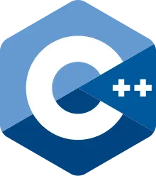

<h2> Hello, This is Ape 😁 </h2>
I'm a self-taught backend developer from 🇲🇦

<h2>About me:</h2>

  * 🔭 I’m currently working on backwards engineering
  * 🌱 I’m currently learning C++
  * 📫 How to reach me: Discord ap_e
 
<h2> Skills </h2>

 
 

